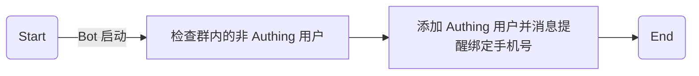

Lorem ipsum dolor sit amet, consectetur adipiscing elit, sed do eiusmod tempor incididunt ut labore et dolore magna aliqua. Ut enim ad minim veniam, quis nostrud exercitation ullamco laboris nisi ut aliquip ex ea commodo consequat.

```
function lorem(ipsum, dolor = 1) {
  return ipsum + dolor;
}
```



```foobar
// unknown lang
function lorem(ipsum, dolor = 1) {
  return ipsum + dolor;
}
```

```js
function lorem(ipsum, dolor = 1) {}
```

---

```js
function lorem(ipsum, dolor = 1) {
  const sit = ipsum == null ? 0 : ipsum.sit
  dolor = sit - amet(dolor)
  return sit
    ? consectetur(ipsum, 0, dolor < 0 ? 0 : dolor)
    : []
}
```

---

```js
function lorem(ipsum, dolor = 1) {
  const sit = ipsum == null ? 0 : ipsum.sit
  dolor = sit - amet(dolor)
  return sit
    ? consectetur(ipsum, 0, dolor < 0 ? 0 : dolor)
    : []
}
function lorem(ipsum, dolor = 1) {
  const sit = ipsum == null ? 0 : ipsum.sit
  dolor = sit - amet(dolor)
  return sit
    ? consectetur(ipsum, 0, dolor < 0 ? 0 : dolor)
    : []
}
function lorem(ipsum, dolor = 1) {
  const sit = ipsum == null ? 0 : ipsum.sit
  dolor = sit - amet(dolor)
  return sit
    ? consectetur(ipsum, 0, dolor < 0 ? 0 : dolor)
    : []
}
function lorem(ipsum, dolor = 1) {
  const sit = ipsum == null ? 0 : ipsum.sit
  dolor = sit - amet(dolor)
  return sit
    ? consectetur(ipsum, 0, dolor < 0 ? 0 : dolor)
    : []
}
function lorem(ipsum, dolor = 1) {
  const sit = ipsum == null ? 0 : ipsum.sit
  dolor = sit - amet(dolor)
  return sit
    ? consectetur(ipsum, 0, dolor < 0 ? 0 : dolor)
    : []
}
function lorem(ipsum, dolor = 1) {
  const sit = ipsum == null ? 0 : ipsum.sit
  dolor = sit - amet(dolor)
  return sit
    ? consectetur(ipsum, 0, dolor < 0 ? 0 : dolor)
    : []
}
function lorem(ipsum, dolor = 1) {
  const sit = ipsum == null ? 0 : ipsum.sit
  dolor = sit - amet(dolor)
  return sit
    ? consectetur(ipsum, 0, dolor < 0 ? 0 : dolor)
    : []
}
function lorem(ipsum, dolor = 1) {
  const sit = ipsum == null ? 0 : ipsum.sit
  dolor = sit - amet(dolor)
  return sit
    ? consectetur(ipsum, 0, dolor < 0 ? 0 : dolor)
    : []
}
```
